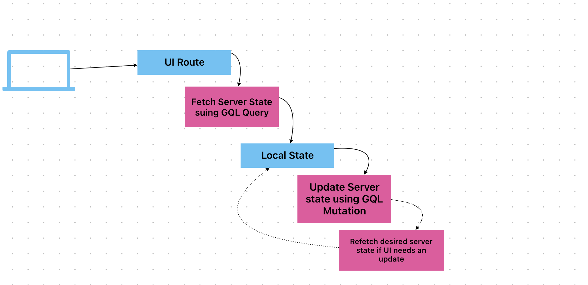

# Modern Front End Application Setup

- Render a list of cats 🐈 🐈 🐈 🐈
- Render details of a single cat 🐈
- Form to create a new cat entry with details 🙀

## Tech Stuff

### Backend 🌐

- A very simple GQL Server using Apollo.
- Basic commonjs and no typescript
- In memorty database
- **Do not** use this as any kind of inspiration :)

### Front End 💅

- React Typescript project scaffolded using Vite
- Uses Vitest for unit and integration testing
- Mantine UI library provides the necessary React components
- wouter provides lightweight routing without a whole lot of ceremonies

### Data flow 🚰

